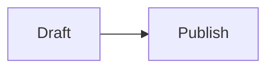

# Booklet — Product Explainer

> A plain-English document explaining what Booklet is, how it works, who it's for, and what
> makes it distinct. Use this as context for any conversation where you need the product
> explained accurately — content creation, FAQs, docs, pitches, investor briefs, demo scripts,
> onboarding copy, support answers, API documentation, or any Claude session where Booklet
> is the subject.

---

## The One-Sentence Version

Booklet is a free web tool that turns the Markdown engineers already write into a clean,
beautifully formatted page the non-technical person on the other end — a PM, an exec, a
customer — can actually open and read, instantly, with no account required.

---

## The Problem

Markdown is the default writing format for technical people. Engineers write READMEs, incident
reports, architecture decision records (ADRs), runbooks, proposals, and meeting notes in Markdown
every day. It's fast, structured, and universally understood within technical teams.

The problem is that Markdown is meant to be *rendered*, not read raw. When a raw Markdown file
gets forwarded outside the technical team — to a product manager, a customer, an executive,
a support agent — it looks like this:

```
## Incident Summary

**Severity:** P1
**Status:** Resolved

### Root Cause

The database connection pool was misconfigured after Tuesday's deploy.

- Pool size set to `5` instead of `50`
- Health check delayed by 90 seconds
- Alert threshold set too high

\`\`\`yaml
pool_size: 5  # was 50
\`\`\`
```

To a non-technical reader, that's noise. The hashes, asterisks, and backticks break the reading
experience and make the content feel unfinished.

### The alternatives are all high-friction

| Option | Why it fails |
|---|---|
| Google Docs | Requires a Google account; not Markdown-native; formatting step is extra work |
| Notion | Requires workspace access or an invite; heavy onboarding |
| GitHub Gist | Poor sharing-optimised rendering; requires GitHub account to create |
| Confluence | Requires corporate SSO; heavyweight |
| HackMD / StackEdit | Collaborative overkill; not optimised for share-only use |
| Paste into Slack/email | Destroys all formatting; no permanent link; no structure preserved |

**Booklet solves this with one step: paste and publish.**

---

## What Booklet Does

1. **You paste Markdown** into the editor. Any Markdown — a README, a post-mortem, an ADR,
   a proposal, a changelog, meeting notes, a runbook, anything.

2. **You see it rendered** in real time — exactly as it will appear to readers. Headings, bold,
   code blocks, tables, bullet lists, task checkboxes, blockquotes, inline code, and diagrams —
   all rendered with beautiful typography and proper spacing.

3. **You hit Publish** (or press `⌘↵`). Booklet generates a unique public URL in under a second.

4. **You send the link.** The recipient opens a clean, well-formatted reading page in their browser.
   No login. No app. No friction.

---

## The Editor

### Interface

The editor is a split-pane interface: Markdown input on the left, live rendered preview on the right.
The preview updates in real time as you type (debounced at 120ms — never lags).

A compact **formatting toolbar** sits above the textarea and provides one-click insertion of common
Markdown syntax. Toolbar actions:

| Button | What it inserts |
|---|---|
| **B** | Bold — wraps selection in `**...**` |
| _I_ | Italic — wraps selection in `*...*` |
| S̶ | Strikethrough — wraps selection in `~~...~~` |
| H1 / H2 / H3 | Heading prefix (`# `, `## `, `### `) — toggles on/off |
| `` ` `` | Inline code — wraps in backticks |
| Code block | Wraps in ` ```\n...\n``` ` |
| Link | Wraps in `[text](url)` |
| Quote | Blockquote prefix (`> `) — toggles |
| Bullet | Bullet list prefix (`- `) — toggles |
| 1. | Ordered list prefix (`1. `) — toggles |

Each button reads the textarea's selection before acting, so toolbar clicks never steal focus.

### Drafts

Drafts are saved automatically to `localStorage` — nothing is transmitted to any server until you
explicitly publish. Features:

- **Unlimited local drafts** — create as many as you need
- **Named drafts** — editable inline; each draft has a name, creation date, word count, and character count
- **Switch, duplicate, delete** from a slide-in drafts panel
- **Persist across sessions** — drafts survive browser restarts
- **Auto-save indicator** — shows "Saving…" / "Saved" with a short smoothing window to prevent flicker

### Keyboard shortcuts

| Action | Shortcut |
|---|---|
| Publish | `⌘↵` |
| New draft | `⌘B` |
| Open drafts | `⌘D` |
| Focus editor | `⌘K` |

### Import

Files can be imported into the editor via drag-and-drop or file picker:
- Accepts `.md` and `text/markdown` MIME type
- Maximum file size: 500KB
- Imported draft gets name: "Imported draft" (editable)

### Export

From the editor (overflow menu):
- **Copy as HTML** — copies the rendered page as clean, standalone HTML
- **Copy as Markdown** — copies the raw Markdown to clipboard

From the published share page (Export menu in header):
- **Download Markdown** — downloads the original `.md` source file (available for pages published after April 2026, when raw MD storage was added)
- **Download HTML** — downloads a self-contained `.html` file with inline CSS; readable without any external resources
- **Print / Save as PDF** — triggers the browser's print dialog; produces a clean, chrome-free PDF

### Character and size limits

- Editor accepts up to **200,000 characters** of Markdown input
- Published page payloads are capped at **600,000 bytes** (MongoDB storage — increased from 350KB to accommodate optional raw markdown alongside blocks)

---

## Publishing

### The publish flow

1. Click the **Publish** button in the top bar, or press `⌘↵`
2. Booklet parses the Markdown, converts it to a portable block format, and stores it server-side
3. A unique **10-character random ID** is generated (e.g. `Ab3k91QxZp`)
4. The full public URL is returned instantly: `booklet.ashwinsathian.com/p/Ab3k91QxZp`
5. The URL is shown in a toast with a one-click copy button

### Rate limiting

Publishing is rate-limited to **12 publishes per minute per IP** to prevent abuse. This is implemented
via a MongoDB-backed sliding-window counter — no auth required. Anonymous publishing is also capped
at **10 pages per month per IP**; signed-in accounts have no monthly cap.

### Immutability

Published pages are **immutable snapshots**. You cannot edit a published page. To update, edit your
local draft and republish — which creates a new URL. The old URL continues to work indefinitely;
nothing is deleted automatically.

This is intentional: a shared link should always show exactly what was sent to the recipient.

---

## The Published Page

### Header

A minimal sticky header containing:
- Booklet logo + wordmark
- Theme toggle (dark/light)
- **Export menu** — dropdown with: Download Markdown (if available), Download HTML, Print / Save as PDF
- "Make your own →" CTA button (links to `/app`)

### Content rendering

The published page renders all Markdown elements with care:

| Element | Rendering detail |
|---|---|
| H1–H4 headings | Size hierarchy, tight tracking, anchor links |
| Body text | 15–16px, 1.8 line-height |
| **Bold** / *italic* / ~~strikethrough~~ | Correct weight/style/decoration |
| Fenced code blocks | macOS-style header, language label, line count, copy button, collapse for long blocks |
| Inline code | Monospace, subtle background |
| Tables | Alternating row shading, hover highlight, horizontal scroll on mobile |
| Blockquotes | Left border in Booklet Purple, indented |
| Task lists | Read-only checkboxes |
| Ordered/unordered lists | Nested support |
| Images | External URLs only, rounded corners, optional caption (alt text) |
| Horizontal rule | Subtle divider |
| Mermaid diagrams | Rendered inline |

Supported Mermaid fence types include `flowchart` / `graph`, `sequenceDiagram`,
`classDiagram`, `erDiagram`, `gantt`, `stateDiagram-v2`, `pie`, and `gitGraph`.
Use a fenced code block with the `mermaid` language:

````

````

### Table of Contents

Automatically generated for documents with **3 or more headings**:
- **Desktop:** sticky sidebar on the right, scroll-tracked via IntersectionObserver
- **Mobile:** collapsible accordion above the content
- Active heading highlighted as you scroll
- Smooth-scroll to heading on click

### Export from the share page

The **Export** dropdown in the share page header offers three options:

- **Download Markdown** — available when the doc was published after raw MD storage was added
  (April 2026). Downloads the exact `.md` source the author wrote.
- **Download HTML** — always available. Produces a complete, self-contained `.html` file with
  inline CSS for clean offline reading.
- **Print / Save as PDF** — triggers the browser's print function (`⌘P` or File → Print). Print
  styles produce a clean, chrome-free PDF: white background, black text, wrapped code blocks,
  no ads, no nav, no cookie banners.

### Footer

- Booklet logo
- Publish date
- "Create your own →" link to `/app`

---

## Page Lifespan

| User type | Page lifespan | Pages per month |
|---|---|---|
| Anonymous (no account) | **Permanent** — no expiry | **10** per IP |
| Signed-in user (account owner) | **Permanent** — no expiry | Unlimited |

Anonymous publishing is not a trial of a temporary product — pages published without an account are
stored exactly the same way as owned pages and never auto-delete. The only anonymous-tier constraint
is a 10-page-per-month publish quota; an account removes that cap and adds ownership (My Pages,
custom slugs, analytics, version history, API access), not permanence.

---

## All Features

### Core (available to everyone — no account required)

| Feature | Detail |
|---|---|
| **Live split-pane editor** | Real-time preview, 120ms debounce, exactly what readers will see |
| **Formatting toolbar** | One-click bold, italic, headings, links, code, quote, lists — selection-aware, toggleable |
| **One-click publish** | `⌘↵` or the Publish button; URL returned in under a second |
| **Beautiful rendering** | All GFM elements rendered with typographic care out of the box |
| **Unlimited local drafts** | Named, auto-saved to `localStorage`, persists across sessions |
| **Draft management** | Rename, duplicate, delete, switch drafts |
| **Multiple drafts** | No limit on number of local drafts |
| **Table of Contents** | Auto-generated for docs with ≥3 headings; scroll-tracked on desktop, accordion on mobile |
| **Code blocks** | Language label, copy button, line count, macOS-style header, collapse for long blocks |
| **Diagram support** | Mermaid diagrams rendered inline in editor and on published page |
| **Theme toggle** | Dark / light mode; dark is the default; persists across sessions |
| **Export (editor)** | Copy as Markdown or HTML from the editor overflow menu |
| **Export (share page)** | Download Markdown (when available), Download HTML, Print / Save as PDF |
| **Link-only sharing** | No index, no feed — published pages are only accessible via direct link |
| **File import** | Drag-and-drop or file picker for `.md` files up to 500KB |

### Account features (free, requires an account)

| Feature | Detail |
|---|---|
| **Unlimited pages** | No monthly publish cap (anonymous is capped at 10/month per IP) |
| **Custom slugs** | Human-readable URL: `booklet.ashwinsathian.com/p/q4-incident-summary` (1–60 chars, lowercase/numbers/hyphens) |
| **Unlisted pages** | Published but excluded from any discovery; link-only access |
| **View counts** | Track how many times each published page has been viewed |
| **My Pages dashboard** | Manage all published pages — view, copy link, toggle visibility, edit slug, delete |
| **Update pages via API** | `PATCH /api/v1/pages/{id}` — republish content to an existing page ID |
| **API access** | REST API with API key authentication for publishing from CI/scripts |
| **API key management** | Generate and revoke API keys from the My Pages dashboard |

---

## The REST API

Booklet exposes a REST API for publishing pages programmatically. Requires a signed-in account
and a generated API key.

### Authentication

All API requests must include the API key in the `Authorization` header:

```
Authorization: Bearer rdbl_YOURKEYHERE
```

API keys are generated in the My Pages dashboard (`/my-pages`).

### Publish a new page

```
POST /api/v1/publish
```

Publishes a new page and returns its URL.

**Request body:**

Supply either `raw` (Markdown string — parsed server-side) or `blocks` (pre-parsed block array):

```json
{ "raw": "# My Doc\n\nContent here." }
```

```json
{
  "blocks": [...],
  "settings": { "width": "normal" }
}
```

**Response (201):**

```json
{
  "id": "Ab3k91QxZp",
  "url": "https://booklet.ashwinsathian.com/p/Ab3k91QxZp"
}
```

**Error responses:**

| Status | Reason |
|---|---|
| 400 | Invalid JSON, empty document, or missing `raw`/`blocks` |
| 401 | Missing or invalid API key |
| 413 | Document too large (>350KB) |
| 500 | Internal storage error |

### Update an existing page

```
PATCH /api/v1/pages/{id}
```

Republishes content to an existing page ID (account-owned pages only). Maintains the same URL.

**Request body:** Same as publish (`blocks`, optional `settings`).

**Response (200):**

```json
{
  "id": "Ab3k91QxZp",
  "url": "https://booklet.ashwinsathian.com/p/Ab3k91QxZp",
  "updated_at": "2026-04-29T12:00:00.000Z"
}
```

**Error responses:**

| Status | Reason |
|---|---|
| 401 | Missing or invalid API key |
| 403 | Page belongs to a different account |
| 404 | Page not found |
| 413 | Document too large |

### List your pages

```
GET /api/v1/pages
```

Returns all pages owned by the authenticated account.

**Response (200):**

```json
{
  "pages": [
    {
      "id": "Ab3k91QxZp",
      "title": "My Document",
      "slug": "my-doc",
      "visibility": "public",
      "view_count": 42,
      "url": "https://booklet.ashwinsathian.com/p/my-doc",
      "created_at": "2026-04-29T10:00:00.000Z",
      "updated_at": "2026-04-29T10:00:00.000Z"
    }
  ]
}
```

---

### GitHub Actions workflow example

Publish or update a Booklet page every time you push a release tag:

```yaml
# .github/workflows/publish-release-notes.yml
name: Publish release notes

on:
  push:
    tags: ["v*"]

jobs:
  publish:
    runs-on: ubuntu-latest
    steps:
      - uses: actions/checkout@v4

      - name: Publish to Booklet
        env:
          READABLE_API_KEY: ${{ secrets.READABLE_API_KEY }}
          PAGE_ID: ${{ vars.READABLE_PAGE_ID }}   # optional: set to update in-place
        run: |
          BODY=$(jq -n --rawfile raw CHANGELOG.md '{"raw": $raw}')

          if [ -n "$PAGE_ID" ]; then
            # Update existing page
            curl -fsSL -X PATCH "https://booklet.ashwinsathian.com/api/v1/pages/$PAGE_ID" \
              -H "Authorization: Bearer $READABLE_API_KEY" \
              -H "Content-Type: application/json" \
              -d "$BODY"
          else
            # Publish new page, print URL
            curl -fsSL -X POST "https://booklet.ashwinsathian.com/api/v1/publish" \
              -H "Authorization: Bearer $READABLE_API_KEY" \
              -H "Content-Type: application/json" \
              -d "$BODY" | jq -r '.url'
          fi
```

Set `READABLE_API_KEY` as a repository secret (Settings → Secrets → Actions). Optionally pin `READABLE_PAGE_ID` as a repository variable to update the same URL on every release.

### API use cases

- Publishing post-mortems automatically from incident management tools (e.g. PagerDuty webhooks)
- Publishing release notes from a CI/CD pipeline (e.g. GitHub Actions after a release tag)
- Publishing changelogs as part of a monorepo build process
- Publishing API documentation from generated Markdown outputs
- Keeping a team runbook up to date by publishing from a scheduled script

---

## The My Pages Dashboard

Available to signed-in users at `/my-pages`.

Displays all published pages owned by the account, each showing:
- Page title (extracted from first H1/H2 heading)
- Full public URL
- Publish date and last-updated date
- View count
- Visibility status (public / unlisted)
- Custom slug (editable inline)

Per-page actions:
- **Copy link** — copies the public URL to clipboard
- **Open page** — opens the published page in a new tab
- **Toggle visibility** — switches between public and unlisted
- **Edit slug** — opens an inline slug editor (`{host}/p/` prefix shown)
- **Delete** — two-step confirmation to delete the page (removes the page document and its DB record)

---

## Anonymous vs. Signed-in

| | Anonymous | Signed-in (free account) |
|---|---|---|
| Create & edit drafts | ✓ | ✓ |
| Publish pages | ✓ | ✓ |
| All rendering features | ✓ | ✓ |
| Page lifespan | Permanent | Permanent |
| Pages per month | 10 (per IP) | Unlimited |
| Custom slugs | — | ✓ |
| Unlisted pages | — | ✓ |
| View counts | — | ✓ |
| My Pages dashboard | — | ✓ |
| REST API + API keys | — | ✓ |
| Update published pages | — | ✓ |

Sign-in is email + password — in-house auth, no third-party identity provider.

---

## Technical Architecture

| Layer | Technology | Notes |
|---|---|---|
| Framework | Next.js 16 (App Router) | React 19, TypeScript strict |
| Styling | Tailwind CSS v4 | CSS-variable design tokens, dark-first |
| Auth | In-house (email + password) | argon2id hashing, DB-backed opaque sessions, API keys for programmatic access — no third-party identity provider |
| Markdown parsing | unified / remark / remark-gfm | Pipeline: parse → process → AST |
| Rendering | Custom AST block renderer | `dangerouslySetInnerHTML` used only for library-sanitised output (KaTeX, highlight.js); no unescaped user input reaches it |
| Storage — all pages, users, teams, etc. | Self-hosted MongoDB | Single database for anonymous and owned pages alike; anonymous pages stored indefinitely, no TTL |
| Infrastructure | Single PM2 process on a personal Mac, behind a Cloudflare Tunnel | Cloudflare Workers/OpenNext was fully built and deployed, then deliberately removed 2026-05-25 (`9254448`) in favor of this — not an incomplete migration |
| Rate limiting | MongoDB-backed counter (`src/lib/rate-limit.ts`) | 12 publishes/min per IP; monthly anonymous-publish quota also enforced server-side |
| Analytics | Google Analytics 4 | |
| Fonts | Inter via next/font (self-hosted) | |
| Diagrams | Mermaid | Client-side rendering |

### Key architectural facts relevant to product copy

- **Drafts are 100% private until publish.** They live in `localStorage` and are never sent to any server.
- **The custom renderer makes all Markdown content XSS-safe.** `dangerouslySetInnerHTML` is used in a few places (KaTeX math, highlight.js code blocks), but only with each library's own sanitised/escaped output — no unescaped user input reaches it. Render-failure fallbacks (e.g. malformed math) render the raw source as an escaped JSX child, not raw HTML.
- **The platform is stateless for anonymous users.** No cookies, no sessions, no tracking until the moment of publish.

---

## What Booklet Does Not Do

These are intentional omissions:

| Omission | Why intentional |
|---|---|
| No real-time collaborative editing | Booklet is not a shared editor. Collaboration happens via the published link. |
| No editing after publish | Published pages are immutable snapshots; stability of shared links is a feature |
| No rich text / WYSIWYG | Markdown only — no drag-and-drop block editor; the formatting toolbar assists with syntax but does not hide it |
| No embedded media | External image URLs rendered; no video/audio/iframes |
| No search or directory | No public index of Booklet pages |
| No comments or reactions | Read-only for recipients |

---

## Supported Markdown (GitHub-Flavored Markdown)

Booklet supports GFM — the most widely used Markdown dialect:

- Headings H1–H4
- Bold, italic, strikethrough
- Inline code and fenced code blocks (with syntax label)
- Tables (aligned columns)
- Ordered and unordered lists (nested)
- Task lists with checkboxes
- Blockquotes (nested)
- Horizontal rules
- Links
- Images (external URLs only; inline images from data URIs are not supported)
- Mermaid diagram blocks
- KaTeX math (inline `$...$` and block `$$...$$`)
- HTML in Markdown is **not** rendered (security policy)

---

## Frequently Asked Questions

**Do I need an account to use Booklet?**  
No. Paste, preview, and publish immediately — no signup, no email, no password. An account removes the 10-pages-per-month cap and unlocks custom slugs, the API, view counts, and the My Pages dashboard.

**Is my content private before I publish?**  
Yes. Drafts are stored entirely in your browser's localStorage and are never transmitted to any server. Nothing leaves your device until you click Publish.

**Can I edit a page after publishing?**  
No for anonymous pages. Account holders can use `PATCH /api/v1/pages/{id}` to republish updated content to the same page ID. For anonymous pages, edit your local draft and republish — creating a new URL. The old URL keeps working indefinitely.

**Do published pages ever expire?**  
No. Published pages — anonymous or account-owned — are permanent and never auto-delete. The only anonymous-tier limit is a 10-page-per-month publish quota per IP; there's no limit for signed-in accounts.

**Can I use Booklet for sensitive or confidential content?**  
Signed-in users can password-protect pages. The "unlisted" option hides the page from discovery, but anyone who has the URL can still open it. For genuinely confidential content, combine password protection with careful link sharing.

**Does Booklet support all Markdown features?**  
Booklet supports GitHub-Flavored Markdown (GFM). HTML in Markdown is not rendered for security reasons.

**What does the URL look like?**  
- Anonymous / account without slug: `booklet.ashwinsathian.com/p/Ab3k91QxZp` (10-character random ID)
- Account with custom slug: `booklet.ashwinsathian.com/p/q4-incident-summary`

**Is there a character limit?**  
The editor accepts up to 200,000 characters. Published payloads are capped at 600,000 bytes.

**Where are drafts stored?**  
Entirely in your browser's `localStorage`. Clearing browser storage will delete drafts.

**Can I use the API without signing in?**  
No. API access requires a signed-in account and a generated API key.

**Does Booklet support Mermaid diagrams?**  
Yes. Mermaid diagram blocks (` ```mermaid `) are rendered inline on both the editor preview and the published page.

---

## The Name

A booklet is a small, finished publication — something bound and handed to someone to read, not a rough draft. That's exactly the transformation the product performs: a scattered Markdown file becomes one clean, presentable document, ready to give to a reader who was never going to open the raw source. The name describes the output, not the company.

(The product was previously named "Booklet" — renamed to resolve a collision with an unrelated, long-established readability-scoring SaaS at readable.com.)

---

## Founder

Booklet was built by **Ashwin Sathian**, a software engineer. It started as a personal tool to solve a problem encountered daily: writing beautifully structured Markdown, then watching it fall apart when shared with non-technical colleagues. The product is intentionally minimal — it solves one problem very well.

Contact: ashwinsathyan19@gmail.com

---

*Last updated: July 2026 — renamed Readable → Booklet.*
